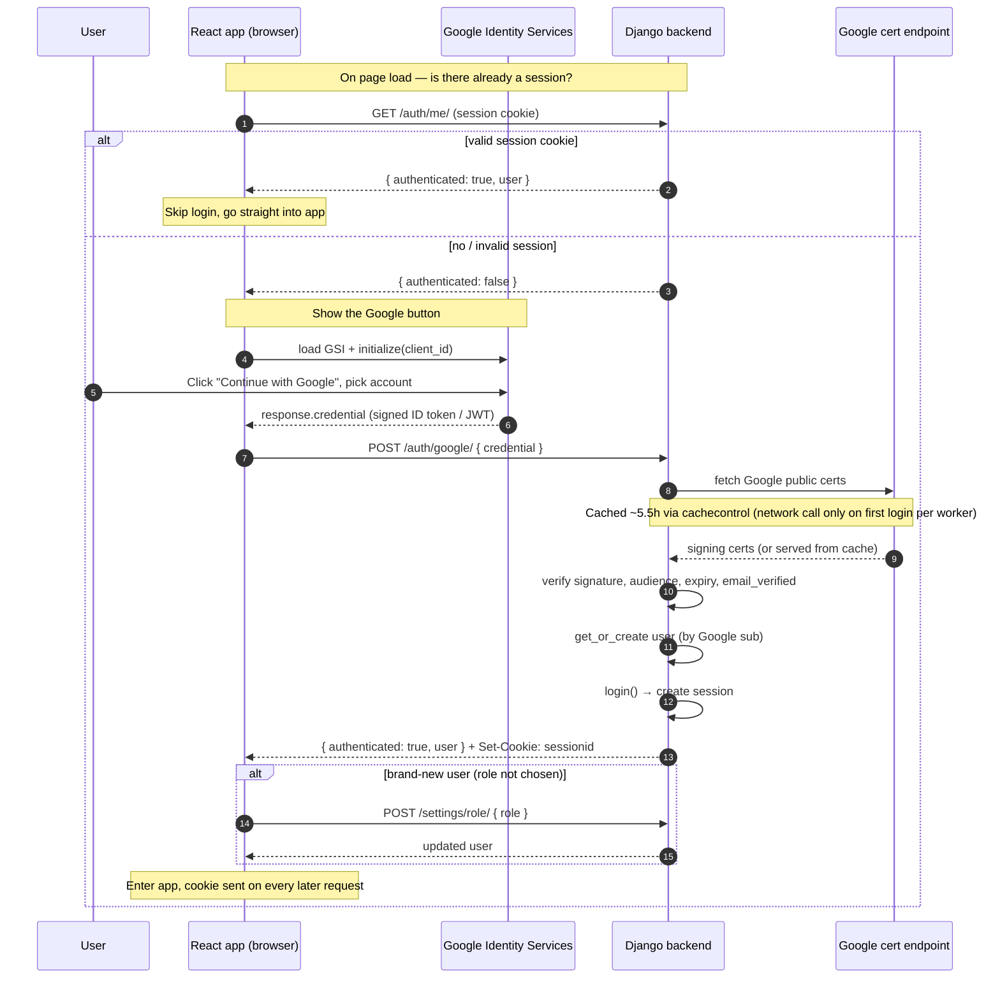

# Google Login Flow in Solveki

End-to-end trace of how a user authenticates with Google, from page load to
an active Django session.

## The pieces

- **React app** (browser) — `frontend/src/LoginPage.jsx`, `frontend/src/auth.js`, `frontend/src/App.jsx`
- **Google Identity Services (GSI)** — Google's `accounts.google.com/gsi/client` script that renders the button and mints the ID token
- **Django backend** — `google_login` in `backend/myapp/views/auth.py`
- **Google's cert endpoint** — public signing keys, cached in-process (see [caching note](#certificate-caching))

## What actually happens

1. **Session check on load.** `App.jsx` calls `fetchMe()` → `GET /auth/me/` with
   `credentials: 'include'`. If the Django session cookie is still valid, the
   user is already logged in and never sees the login page.

2. **Render the Google button.** No session → `LoginPage` loads the GSI script,
   calls `google.accounts.id.initialize({ client_id })`, and renders Google's
   button.

3. **User picks an account.** GSI runs the OAuth dance with Google and hands
   back a **signed ID token (a JWT)** as `response.credential` to the JS
   callback. The app never sees the user's password.

4. **Send token to the backend.** The callback calls
   `loginWithGoogle(credential)` → `POST /auth/google/` with `{ credential }`
   and the cookie included (`frontend/src/auth.js`).

5. **Backend verifies the token** (`backend/myapp/views/auth.py`).
   `verify_oauth2_token` checks the JWT's signature against Google's cached
   public certs, confirms the audience matches `GOOGLE_OAUTH_CLIENT_ID`, and
   checks expiry (with a 10s clock-skew tolerance). It then requires
   `email_verified`.

6. **Find-or-create the user & open a session.** `get_or_create` keyed on the
   Google `sub` (stable id), then `login(request, user)` — Django writes a
   session row and sets the session cookie on the response.

7. **Frontend routes the user in.** `handleLoggedIn` stores the user. If
   `role_chosen` is false (brand-new user), `App.jsx` gates on `RolePicker` →
   `POST /settings/role/`. From then on every request carries the session
   cookie.

## Diagram

## Certificate caching

`verify_oauth2_token` needs Google's public signing certs to check a token's
signature. Google serves those certs with a `Cache-Control: max-age` of roughly
5.5 hours. Solveki reuses one `cachecontrol`-wrapped `requests` session
process-wide (`_google_request` in `auth.py`), so the certs are fetched over the
network only on the **first login after a worker (re)start** and served from
cache thereafter. This removed a ~1.5s per-login HTTPS round trip.

Because the cache is per-process and in-memory, each gunicorn worker warms its
cache independently — so the "first login is slow" cost is paid up to a few
times right after a deploy, then all logins are fast.
